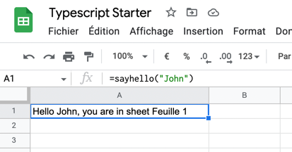

# Initial setup 

npm install -g @google/clasp
npm init

Install Typescript and google apps script types
npm i -D typescript @types/google-apps-script

Create the google sheet & apps script project 

## Using Clasp for easier development

clasp login
clasp create --type sheets --title "Typescript Starter" --rootDir ./src

Move the .clasp.json back to the root dir. I don't know why it's place in src

mv src/.clasp.json . 

Add this in the scripts section of package.json 

    "build": "tsc",
    "push": "clasp push",
    "watch": "clasp push -w"

## Our first script 

Create a file src/Code.ts 

```typescript
import Sheet = GoogleAppsScript.Spreadsheet.Sheet;

function sayHello(name: string): string {
    const currentSheet: Sheet = SpreadsheetApp.getActiveSpreadsheet().getActiveSheet();
    return `Hello ${name}, you are in sheet ${currentSheet.getName()}`;
}
```



## Dynamic menu items 

Create the functions dynamically as follows : 

```typescript
installFunctions();

/**
 * Create goToSheet_xxx function for each sheet in the document
 */
function installFunctions() {
    const ss = SpreadsheetApp.getActiveSpreadsheet();
    ss.getSheets().forEach(s => {
        const id = s.getSheetId();
        this[`goToSheet_${id}`] = () => ss.getSheetByName(s.getName()).activate();
    })
}

```

## Simple logging service 

console.log is nice, but when running a lot of background tasks etc .. it's useful to allow the normal user to see 
what is happening in the application. 

Create a Logs sheet in the document 

Create a Constants.ts file 

```typescript
export class Constants {
    public static SHEET_LOGS: string = "Logs";
}
```

Create a LoggingService.ts file 

```typescript


```